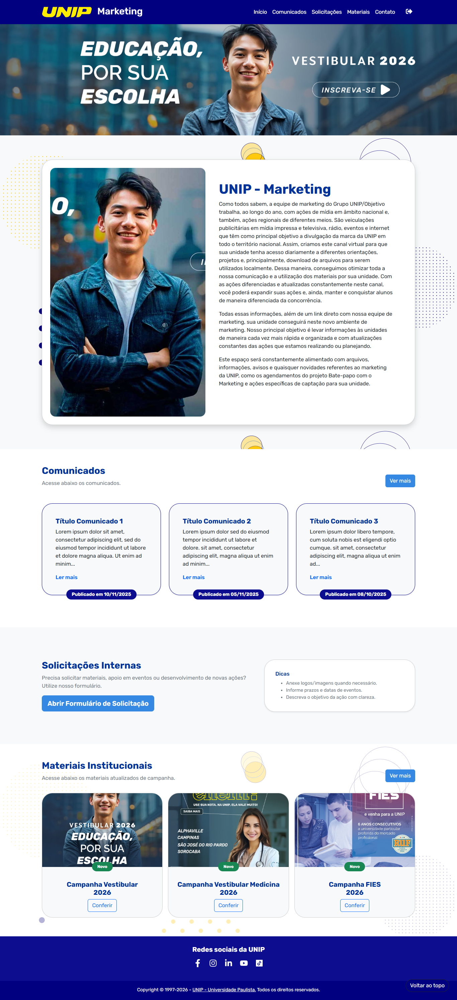
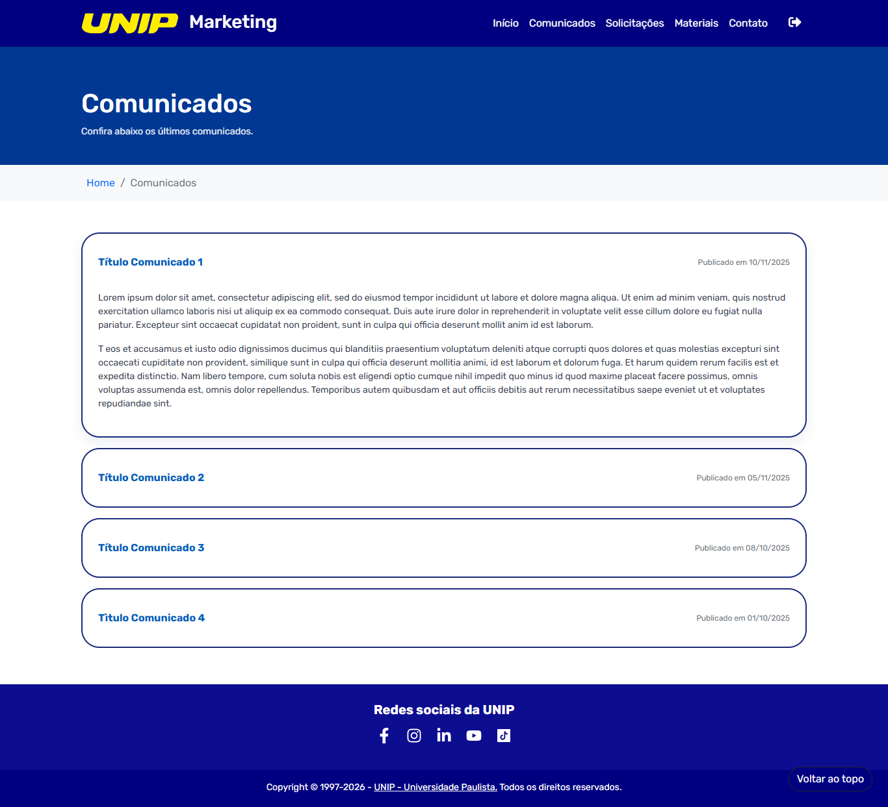
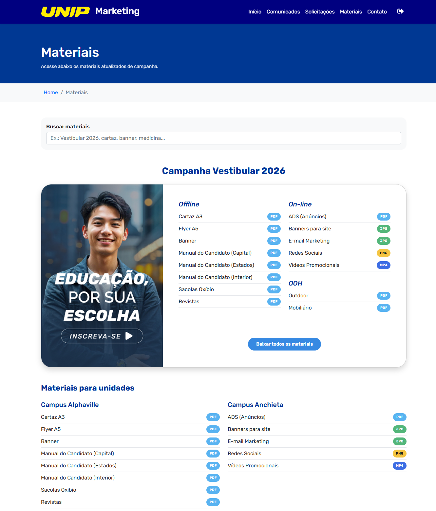
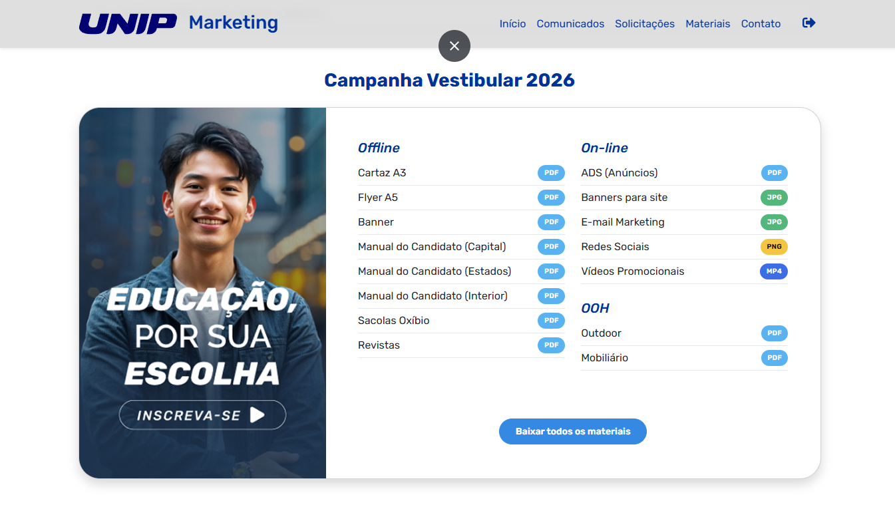
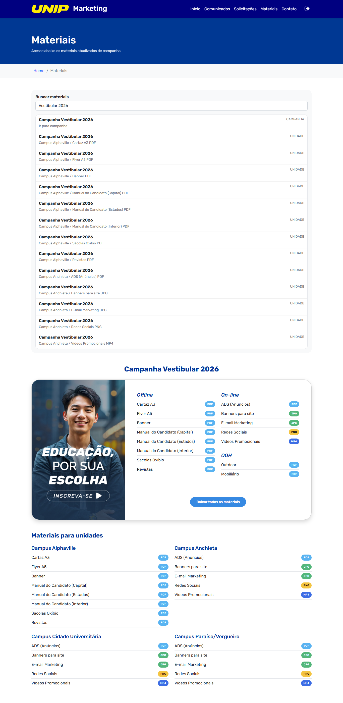
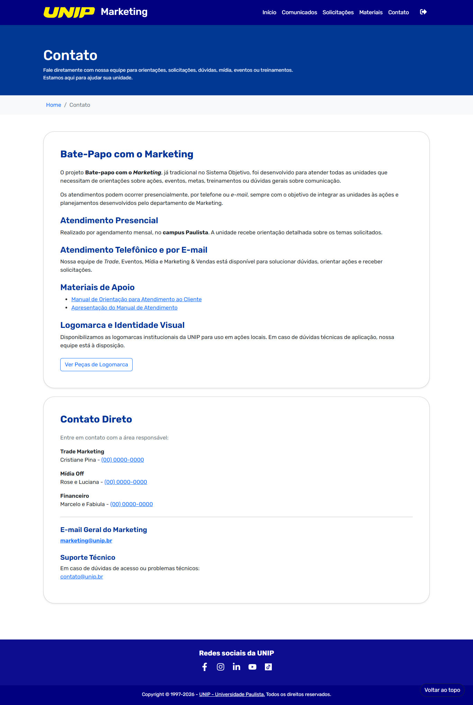

# UNIP Marketing Hub

Portal institucional do time de Marketing da UNIP para centralizar campanhas, comunicados, downloads de materiais e canais de contato com as unidades.

> Este repositório concentra a interface do hub interno com foco em **agilidade operacional**, **padronização da comunicação** e **facilidade de acesso** aos ativos de campanha.

## ✨ Destaques do projeto

- **Hub único de Marketing** com páginas dedicadas para Home, Materiais, Comunicados, Contato e Login.
- **Experiência orientada à operação de unidades**: conteúdos organizados por tipo de campanha, formato e campus.
- **Busca inteligente de materiais** com normalização de acentos e remoção de stopwords, melhorando a encontrabilidade dos arquivos.
- **Download em lote (.zip) no navegador** para acelerar a distribuição de peças sem depender de empacotamento manual.
- **Comunicados dinâmicos em formato accordion**, com destaque para itens novos e ancoragem por URL.
- **Layout responsivo** com Bootstrap e componentes visuais consistentes para desktop e mobile.

## 🧩 Principais implementações

### 1) Gestão de materiais de campanha
A página de materiais (`materiais.aspx`) organiza os ativos por campanhas e categorias (Offline, On-line e OOH), além de blocos específicos por unidade/campus. Isso facilita o acesso rápido ao material correto em cenários regionais.

### 2) Busca contextual com UX otimizada
O script global (`assets/js/scripts.js`) monta um índice local de campanhas e itens de material, aplica normalização textual e oferece resultados acionáveis que levam o usuário ao card correspondente com scroll suave.

### 3) Download consolidado de arquivos
O botão **“Baixar todos os materiais”** agrega os links do card selecionado, faz fetch dos arquivos e gera um `.zip` em tempo real via JSZip + FileSaver, reduzindo atrito operacional.

### 4) Comunicados com leitura progressiva
A listagem de comunicados é transformada em accordion no cliente: abre um item por vez, calcula destaque de “Novo” por data e permite deep-link (`#id`) para abertura direta do comunicado.

### 5) Navegação e usabilidade
Recursos de suporte como botão “Voltar ao topo”, header responsivo com mudança visual em scroll e breadcrumbs reforçam orientação do usuário no fluxo de navegação.

## 🖼️ Galeria do UNIP Marketing Hub

### Tela de Login


### Página inicial (Home)


### Comunicados


### Materiais institucionais


### Card de materiais


### Busca de materiais


### Contato


## 🛠️ Stack e arquitetura

- **Frontend:** ASPX (estrutura de páginas), HTML5, CSS3 e JavaScript.
- **UI framework:** Bootstrap.
- **Bibliotecas auxiliares:** JSZip e FileSaver para empacotamento e download no browser.
- **Organização de layout:** includes reutilizáveis para topo e rodapé (`assets/partial`).

## 📂 Estrutura principal

```text
.
├── default.aspx                # Home
├── login.aspx                  # Acesso ao ambiente
├── materiais.aspx              # Biblioteca de campanhas e downloads
├── comunicados.aspx            # Comunicados oficiais
├── contato.aspx                # Canais de atendimento e suporte
├── assets/
│   ├── css/
│   ├── js/
│   ├── img/
│   └── partial/                # Partials de header/footer
└── docs/images/                # Screenshots do projeto
```

## 🚀 Valor para o negócio

- **Padroniza a comunicação** entre matriz e unidades.
- **Reduz tempo de operação** com busca e download em lote.
- **Aumenta previsibilidade das campanhas** com distribuição centralizada de materiais.
- **Melhora governança de conteúdo** ao concentrar comunicados e ativos em um único ambiente.

---